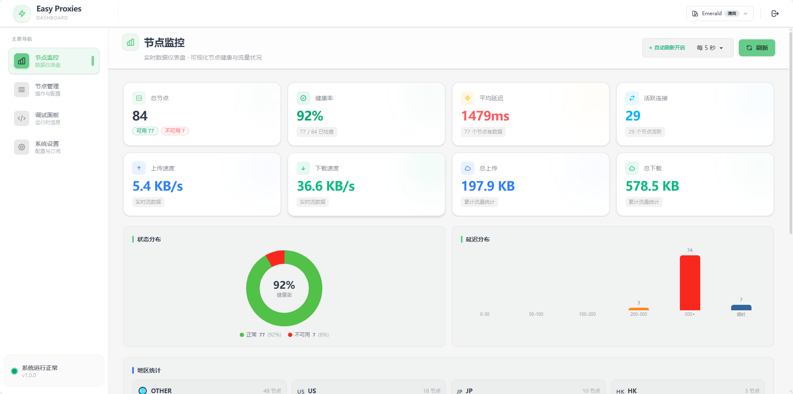
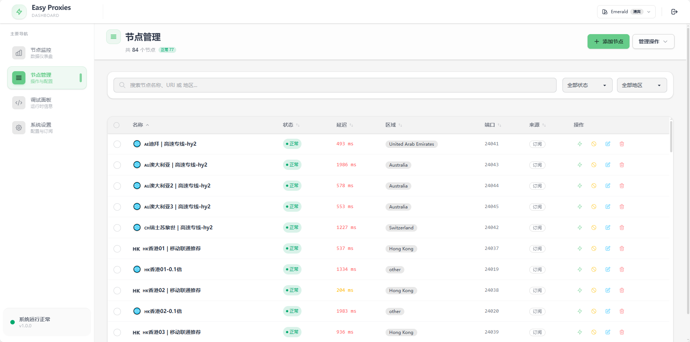
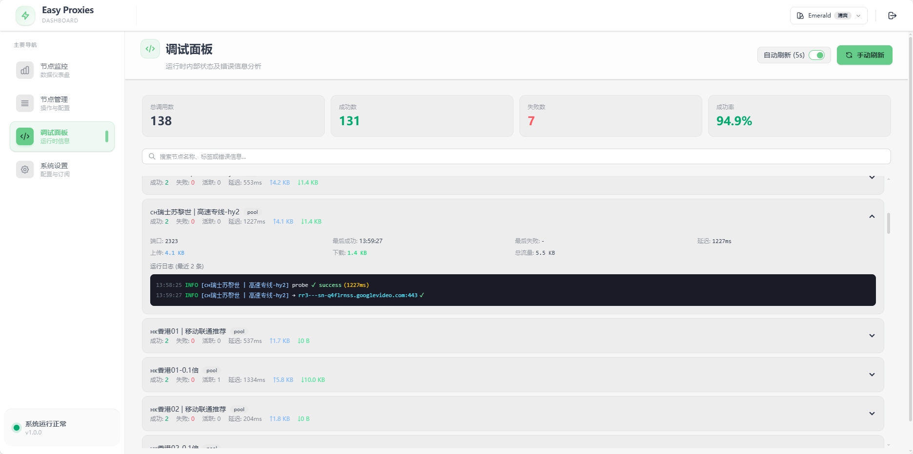
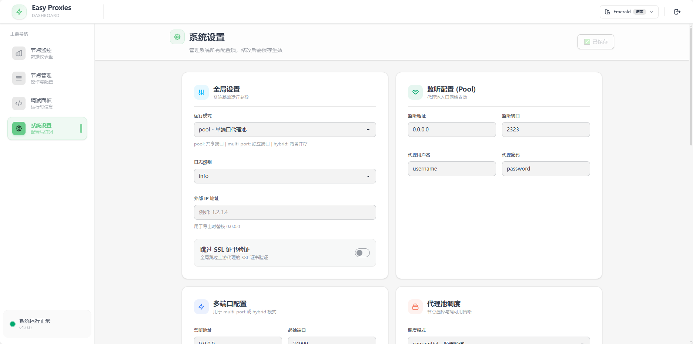

# EasyProxy

EasyProxy 是一个轻量级、高性能的代理池与订阅管理工具，底层基于 [sing-box](https://github.com/SagerNet/sing-box)。
项目内置现代化 Web 管理面板，支持节点健康检查、订阅刷新、流量监控与可视化管理。

> 二开声明：本项目基于 [jasonwong1991/easy_proxies](https://github.com/jasonwong1991/easy_proxies) 二次开发，V2 版本重点重构了前端与工程化流程。

## ❤️ 赞助木木

木木是独立开发者 / 开源爱好者，长期投入开源项目维护与迭代。
如果 EasyProxy 对你有帮助，或者你认可我的工作，欢迎请我喝杯咖啡。你的支持是我持续创造的动力源泉 ⚡

- [赞助地址](https://mumuverse.space:1588/)

---

## ✨ 核心特性

- 现代化 Web UI（React + Vite + Tailwind + DaisyUI）
- 前后端一体化（前端静态资源已内嵌到 Go 二进制，单文件即可运行）
- 节点订阅与自动刷新
- 代理池智能调度与故障隔离
- GeoIP 分区路由（可选）
- Local Server 局域网统一入口与共享/独立设备 Profile
- SQLite 持久化存储运行状态与统计数据

## 🖼️ 项目预览







---

## 🚀 最推荐：直接使用 Release 二进制（Linux / Windows）

你不需要本地安装 Go 和 Node，直接下载发布产物即可使用。

### 1) 下载文件

从 GitHub Releases 下载这两个文件之一：

- Linux: `easy-proxy-linux-amd64`
- Windows: `easy-proxy-windows-amd64.exe`

并同时准备配置文件：

- 将仓库里的 `config.example.yaml` 复制为 `config.yaml`
- 按需修改端口、账号密码、订阅链接等

---

## 🐧 Linux 使用方法

### 1) 赋予执行权限
```bash
chmod +x ./easy-proxy-linux-amd64
```

### 2) 准备配置
```bash
cp ./config.example.yaml ./config.yaml
```

### 3) 启动程序
```bash
./easy-proxy-linux-amd64 --config ./config.yaml
```

### 4) 访问管理面板
默认访问地址：
- `http://127.0.0.1:29888`（本机）
- 或 `http://<服务器IP>:29888`
- 默认密码：`123456`
> 默认管理监听来自配置项 `management.listen`，默认值见 `config.example.yaml`。

---

## 💻 Windows EXE 使用方法

### 1) 准备文件
把下面两个文件放到同一目录：

- `easy-proxy-windows-amd64.exe`
- `config.yaml`（由 `config.example.yaml` 复制并修改）

### 2) 启动程序（PowerShell 或 CMD）
```powershell
.\easy-proxy-windows-amd64.exe --config .\config.yaml
```

### 3) 访问管理面板
浏览器打开：
- `http://127.0.0.1:29888`

---

## ⚙️ 配置说明（最小必读）

配置模板见 `config.example.yaml`，重点关注：

- `mode`: `pool` / `multi-port` / `hybrid`
- `listener`: 代理入口监听与认证（新增 `listener.protocol`: `http` / `socks5` / `mixed`）
- `multi_port`: 多端口入口参数（新增 `multi_port.protocol`: `http` / `socks5` / `mixed`）
- `management.listen`: Web 管理面板地址（默认 `0.0.0.0:29888`）
- `management.password`: 面板登录密码（为空则不需要登录）；服务间调用时也可直接作为 `Authorization` 头值访问管理 API
- `subscriptions` / `nodes_file` / `nodes`: 节点来源（三选一或混用）
- `source_sync.*`: 从 MiSub 拉取 machine manifest，并在失败时启用本地 fallback 订阅
- `source_sync.connector_runtime.*`: 当 manifest 含有 `connector_type = ech_worker` 时，本地拉起 `ech-workers` 并转换成临时上游代理
- `connectors[]` / manifest `connector`: 也支持 `connector_type = zenproxy_client`，运行时会请求 ZenProxy `/api/client/fetch` 并把返回的 sing-box outbound 转成临时节点
- 纯 `source_sync` / 纯 connector 场景现在也可直接启动，不再需要本地占位节点
- `routing.*`: 智能分流入口（默认关闭）。开启后接管 `listener` 端口，HTTP/HTTPS 与 SOCKS5 同端口共存，提供「规则分流（直连/代理）+ 选节点策略（stable/session/auto）+ 节点属性筛选（国家/地区/长效）」三层能力。默认入口（系统代理、无参数）走「中国直连 + 其余 stable 长效稳定」；API 调用可用路径前缀 / `X-Proxy-*` 头 / SOCKS5 username 令牌覆盖。详见 [`docs/smart-routing.md`](../../docs/smart-routing.md)
- `local_server.*`: 局域网 Local Server（默认关闭）。开启后要求 `mode: pool`、`listener.protocol: mixed`，由一套 canonical 用户名/密码同时保护 Web、管理 API、HTTP/CONNECT 和 SOCKS5；支持 shared Profile、完全独立的设备 Profile，以及显式 `+dev=<device_id>` / IP-CIDR 映射选择。设备无需安装独立客户端。详见 [`docs/local-server.md`](../../docs/local-server.md)
- `gateway.*`: Linux/NAS 原生透明 TCP 网关（默认关闭）。支持物理 LAN、Tailscale、星空组网等承载层，通过接口/CIDR 接入同一 EasyProxy 规则和节点池；无可用节点时按 fail-open DIRECT。需要 host networking、`NET_ADMIN`/`NET_RAW` 和宿主机 forwarding/policy routing。详见 [`docs/transparent-gateway.md`](../../docs/transparent-gateway.md)

Local Server 的 IP 映射只读取实际 TCP peer address。Docker bridge、端口
映射和 NAT 可能让多个设备显示为同一个网关 IP，因此稳定设备选择应优先
使用显式 `easyproxy+dev=<device_id>`。部署时必须在路由器和宿主机防火墙上
阻止 WAN、Guest VLAN 和其他不可信网络访问 `22323/29888`；跨不可信网络
请先使用 VPN，或配置带明确访问策略的 TLS 入口。

管理 API 的可观测性补充：

- `GET /api/source-sync/status`
  - 返回当前 manifest / fallback / connector 的总体同步状态
- `GET /api/source-sync/source-health`
  - 按 `source_ref` 聚合返回 `total/effective_available/blacklisted/pending`
    等计数
  - 可用 `?source_ref=manifest:conn_zenproxy_primary` 精确查看某个
    provider 当前 materialize 出来的线路健康度
- `GET /api/debug`
  - 现在也会附带 `source_ref` / `source_name` / `source_kind` 与
    `effective_available` 等字段，方便逐节点排查
  - 每个节点还附带 `long_lived` / `uptime_seconds`，用于长效节点判定
- `GET /api/routing/status`
  - 仅在 `routing.enabled` 时有意义，返回智能分流入口的监听地址、默认策略、
    规则数、兜底策略，以及当前 stable 桶 / session 会话的粘性绑定快照
- `GET /api/gateway/status`
  - 返回透明 TCP listener、规则应用状态、活动连接、DIRECT/PROXY 计数、
    无可用节点时的 DIRECT 回退次数和最近错误
- `GET /api/local-server/status`
  - 返回 Local Server listener/dispatcher、Registry revision、Profile/mapping
    数量，以及 Docker/NAT source-IP 风险提示
- `GET /api/local-server/devices`
  - 返回设备的 shared/independent 模式、有效启用状态、revision、last-seen
    和 mapping 数量；完整 CRUD 与 CAS 说明见 Local Server 文档

---

## 🧪 从源码构建（开发者）

项目由 Go (1.24+) + Node (22+) 构成。

### 1) 构建前端
```bash
cd frontend
npm ci
npm run build
```

### 2) 构建后端
```bash
go mod download
go build -tags "with_utls with_quic with_grpc with_wireguard with_gvisor" -o easy-proxy ./cmd/easy_proxies
```

---

## 📦 Docker（可选）

如果你偏好容器部署，可使用现成的 `Dockerfile` 与 `docker-compose.yml`：

```bash
docker build -t easy-proxy-monorepo:latest .
docker compose up -d
```

如果你的运行时配置不准备挂到默认的 `/etc/easy-proxy/config.yaml`，
可以改为设置环境变量 `EASY_PROXY_CONFIG_PATH`。入口脚本会在真正启动
`easy-proxy` 时优先使用这个路径，而不是镜像内默认 `CMD` 里的占位值。

迁移期并行运行建议：

- 容器名默认使用 `easy-proxy-monorepo`
- 默认代理监听端口使用 `22323`
- 默认管理面板端口使用 `29888`
- 默认多端口起始端口使用 `25000`

这样可以和旧的多仓部署实例并存。

## 📁 目录结构简述

- `cmd/easy_proxies/`: Go 程序入口
- `frontend/`: 前端源码
- `internal/`: 后端核心模块
- `internal/monitor/assets/`: 前端构建产物（会被 Go embed）
- `.github/workflows/build-and-release.yml`: 自动构建与发布流程

---

## 🙏 鸣谢

- 原作者 [jasonwong1991/easy_proxies](https://github.com/jasonwong1991/easy_proxies)
- 核心代理引擎 [sing-box](https://github.com/SagerNet/sing-box)
